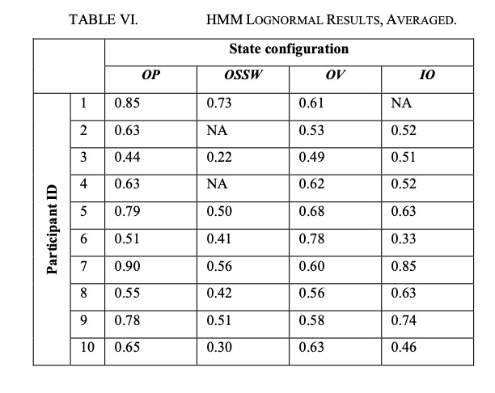

```{r setup, include=FALSE}
knitr::opts_chunk$set(echo = FALSE)
library(tidyverse)
```

# Smartphone-Based Recognition of States and State Changes in Bipolar Disorder Patients

## Study Overview and Data Acquisition

**Objective**

Introduce a system based on smartphone-sensing, which is able to recognize depressive and manic states and detect state changes of patients suffering from bipolar disorder.

**Real-life Dataset**

\begin{itemize}
\setbeamertemplate{items}[circle]
\item 10 patients
\item 10 month, 12 weeks per patient (in total over 800 days of data tracing 17 state changes) at a rural area psychiatric hospital in Austria
\item recorded by four different sensing modalities
\end{itemize}

## Data Collection

1. A developed logging application in **Android smartphone** was designed to record all sensor data automatically.

2. The selection of patients was entirely done by the ward's psychiatrists' perception.

3. Psychological state examinations (HAMD or YMRS) were frequently performed every three weeks: \

**Seven Classes**

-3 for severe depression; +3 for severe mania with intermediate steps of depression; 
slight depression; normal (0); slight mania and mania 

## Recognizing the State 

**Sensors and Features**
\begin{itemize}
\setbeamertemplate{items}[ball]
\item Social interaction: phone + sound calls/text message.
\item Physical motion
\item Travel patterns: GPS/Acceleration
\end{itemize}

**Classification Method**
\begin{itemize}
\setbeamertemplate{items}[ball]
\item Training:  For the actual classification, features were first transformed using a Linear Discriminant Analysis. The classes for the classification were defined according to the diagnosis provided by psychologists.
\item Test:  The Naive Bayes classifier included in Weka, k-nearest neighbor, j48 search tree and conjunctive rule learner. Similar results.
\item repeat 500 times in a cross-validation approach
\end{itemize}

## Recognizing the State 

```{r, echo=FALSE,warning= FALSE, message = FALSE, echo=FALSE,out.width='100%',fig.pos='h', fig.align = "center"}

```

The recognition accuracies is 76% by fusing all sensor modalities.
This means that, as assumed earlier, the combination of social behavior, travel patterns, and movement, by covering different aspects in the patient’s behavior, optimizes the state detection and provides better results than single sensors or fusion of only a few sensor modalities


## Detection of State Changes

1. Build a model of a single "default state". 

2. All points falling outside this model are classified as a “change.”


```{r,warning= FALSE, message = FALSE,out.width='49%',fig.show='hold',fig.align='center'}


```

The state change detection precision and recall is over 97%. 


# Multivariate Hidden Markov Models for Personal Smartphone Sensor Data: Time Series Analysis

## Objective

Smartphone-based human activity recognition (HAR) offers growing value for health research. Assess the general potential for Hidden Markov Models (HMMs) to be used in modelling a person's physical status by means of multivariate smartphone sensor data.

## Data

**Ground-truth data from a small self-report study.**

11 sensors: accelerometer, gyroscope, Wi-Fi, location (pseudo-sensor consisting of GPS and network-based location data), battery level, humidity, pressure, temperature, light, proximity, orientation (pseudo-sensor based on accelerometer, magnetometer), and Bluetooth.

14 features: 
```{r, echo=FALSE,warning= FALSE, message = FALSE, echo=FALSE,out.width='45%',fig.pos='h', fig.align = "center"}

```

## Model
- Assumption:
1. HMM state-specific dwell times (number of contiguous time-steps in a particular state before transitioning) follow a geometric distribution. 
2. Any two observations are conditionally independent, given that they are drawn from the same state. 

- Training:  

1. Parameters: transition probability matrix, the unconditional (starting) state probability vector, and those associated with the state-conditional probability distributions. 
2. Using supervised Maximum a posteriori (MAP) estimate, a predicted state sequence will be produced by the Viterbi algorithm. 

- Validation: 

Using Four-fold cross-validation with macro F1score statistic. Comparing the output sequence of states to the actual sequence of states, and producing a confusion matrix.

## Model
- Selection:  

Experimented with a variety of state-conditional probability distributions.

**Parametric**

The chief option studied was a lognormal fit to each of the magnitudes of linear acceleration and rotational velocity. 

**Non-parametric**

1. a univariate kernel density estimate (KDE)
2. a naive multivariate extension of the first

```{r,warning= FALSE, message = FALSE,out.width='45%',fig.show='hold',fig.align='center'}
 
```


## Results

```{r,warning= FALSE, message = FALSE,out.width='45%',fig.show='hold',fig.align='center'}
 
knitr::include_graphics("plot/MultiHMM3.jpg") 
```

The HMMs achieved reasonable accuracy in classifying phone off-person vs. phone on-person, off-vehicle vs. on-vehicle, and phone off-person vs. sitting vs. standing vs. walking, for some participants. 

Tables VI and VII show the comparison between a Gaussian NB classifier and a Gaussian HMM. They each display the averaged results of univariate Gaussian fits to linear-acceleration and rotational-speed, across all participants and state configurations. 
