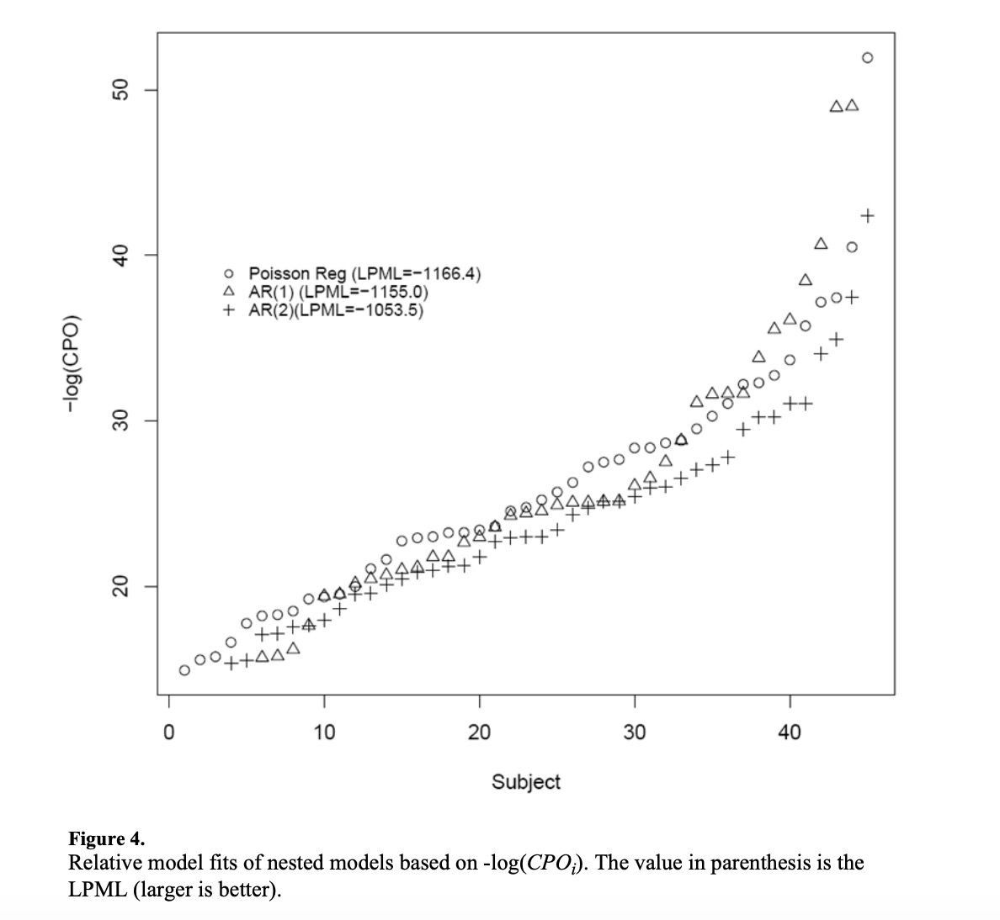
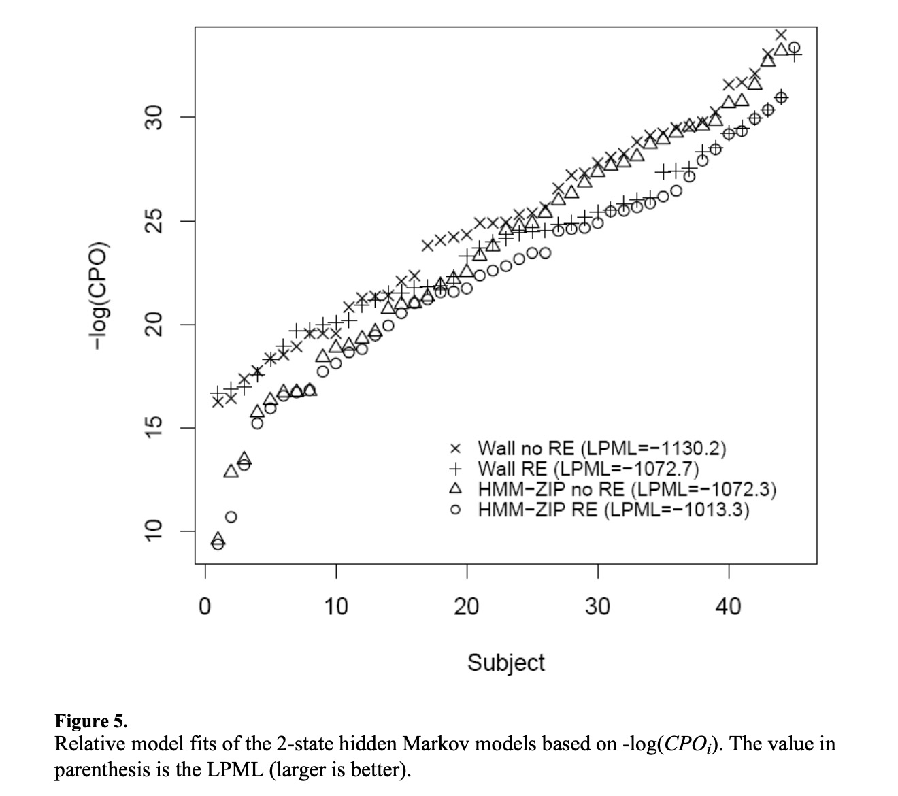
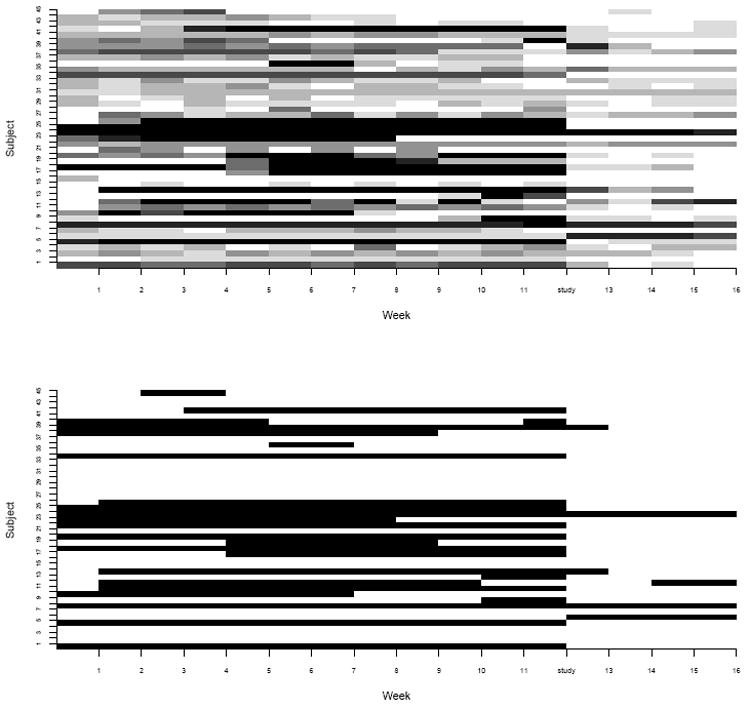

```{r setup, include=FALSE}
knitr::opts_chunk$set(echo = FALSE)
library(tidyverse)
```

## Data and Objective

- Data

From an experiment performed on 45 cocaine-dependent participants that consist of daily diaries of cocaine use collected using the method of Time- Line Follow-Back (TLFB). 12 weeks prior and 4 weeks after completion of the 2-day stress and cue-reactivity study.

- Objective

Whether participation in a non-treatment outpatient clinical study is protective or detrimental(study participation alters drug seeking behavior or not) in terms of frequency of follow-up drug use among cocaine-dependent participants and to determine relevant demographic predictors of use parameters.

## ZIP Hidden Markov Model for Poisson Counts
\small
ZIP-HMM:
\[
\left(Z_{i t} | S_{i t}\right)=\left\{\begin{array}{cc}
0 & \text { w.p. } \pi_{i t} \\
\text { Poisson }\left(\theta_{i t}\right) & \text { w.p.1 }-\pi_{i t}
\end{array}\right.
\]
\[
log(\theta_{it}) = {\lambda_{0i} + \lambda_{1i} S_{it-1}}
\]
Poisson distribution: 
\[
f\left(Z_{i t} | \theta_{i t}, S_{i t}=1, X_{i t}, X_{T R T_{i t}}\right)=\frac{1}{z_{i t} !} e^{-\theta_{i t}} \theta_{i t}^{z_{i t}}
\]
Transition probabilities: 
\[
\begin{array}{l}
p_{i t}^{00}=P\left(S_{i t}=0 | S_{i, t-1}=0, X_{i t}, X_{T R T_{i t}}\right) \\
p_{i t}^{10}=P\left(S_{i t}=1 | S_{i, t-1}=0, X_{i t}, X_{T R T_{i t}}\right) \\
p_{i t}^{01}=P\left(S_{i t}=0 | S_{i, t-1}=1, X_{i t}, X_{T R T_{i t}}\right) \\
p_{i t}^{11}=P\left(S_{i t}=1 | S_{i, t-1}=1, X_{i t}, X_{T R T_{i t}}\right)
\end{array}
\]
Transitioning or remaining high:
\[
p_{i t}^{1 S_{(i, t-1)}}=\log \mathrm{it}^{-1}\left(\beta_{0}+\beta_{1} S_{i, t-1}+\beta_{2} X_{i t}+\beta_{3} X_{T R T_{i t}}\right)
\]
Low-risk group: 
$$
\operatorname{logit}\left(\pi_{i t} | Y_{i t}\right)=\alpha_{0}+\alpha_{1} Y_{i t 1}+\cdots+\alpha_{j} Y_{i t}
$$

##  Bayesian Inference

Estimation of exact posterior distribution:

- Gibbs sampler 
- MCMC algorithms

Implement tool: 

- WinBUGS

## Comparison with other models

- conditional predictive ordinate statistic: $-log(CPO)_i$ (Smaller)
- log pseudo-marginal likelihood: LPML (Larger)

1. Nested 1-state models
```{r, echo=FALSE,warning= FALSE, message = FALSE, echo=FALSE,out.width='70%',fig.pos='h', fig.align = "center"}

```

## Comparison with other models

2. Second order HMM

```{r, echo=FALSE,warning= FALSE, message = FALSE, echo=FALSE,out.width='70%',fig.pos='h', fig.align = "center"}

```

## Results

\small

Top: the matrix of weekly drug use counts for each participant in the study.
Bottom: membership in the hidden state derived from posterior probabilities.

```{r, echo=FALSE,warning= FALSE, message = FALSE, echo=FALSE,out.width='55%',fig.pos='h', fig.align = "center"}

```

- $OR_{TRT_{O}} = 0.06 [0.01,0.19]$
- Highly preventative effect: study-benefit (seen after week 12) in reducing drug-seeking behavior


## Question

1. ZIP vs ZINB 

2. The number of state? '1-state','2-state','3-state'...

3. Bayesian approach vs likelihood-based frequentist approach

4. Deviance information criteria (DIC) is more commonly used for for Bayesian model selection? (Mentioned by the author for future work)


